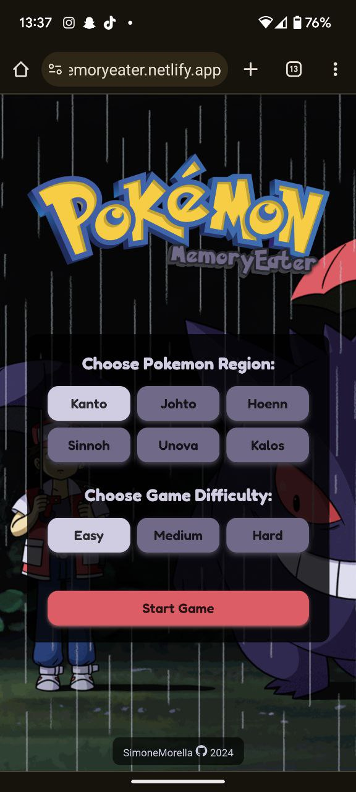
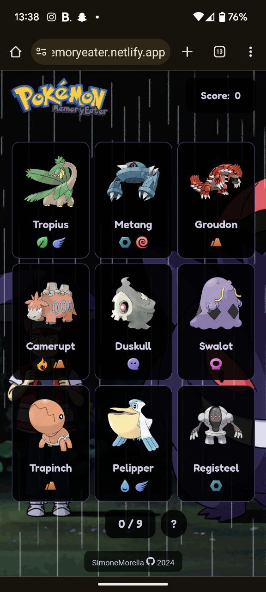

# Pokemon Memory Eater
## Fan Pokemon Card Game

___

### How it works?

  

This Card Memory Game works in an intuitive UX-Driven way. A sample is given in the images above.  
After deciding the Generation, aka the Pokemon Region, the difficulty of the game must be decided.  
- Easy: 6 cards show up indicating 6 rounds to win the game.
- Medium: 8 cards show up indicating 8 rounds to win the game.
- Hard: 9 cards and 9 rounds to win the game.
After starting and a brief loading through a pokeball animation you will start the actual game.
Enjoy, and when you finish (lose or win) you can decide if you want to restart with the same gen,
or going to the main menu and choose another Pokémon Generation.

___

### Info about development 
This project was completely developed with the React.js library.  
Vite was used for the setup and TailwindCSS for the styling.  
The website is completely responsive and it was debugged through the Pixel 7 for any front-end bug.  
A huge use of Hooks like UseRef, UseState and UseEffect was done through the development.  
Mainly to manage the huge amount of API fetching from **PokeAPI** and to manage the animation control of  
the **Framer** library.  
Additional library like **React-tooltip** and **React-Parallax-Tilt** were used.

___

Here the [Live Version](https://pokemonmemoryeater.netlify.app/)
